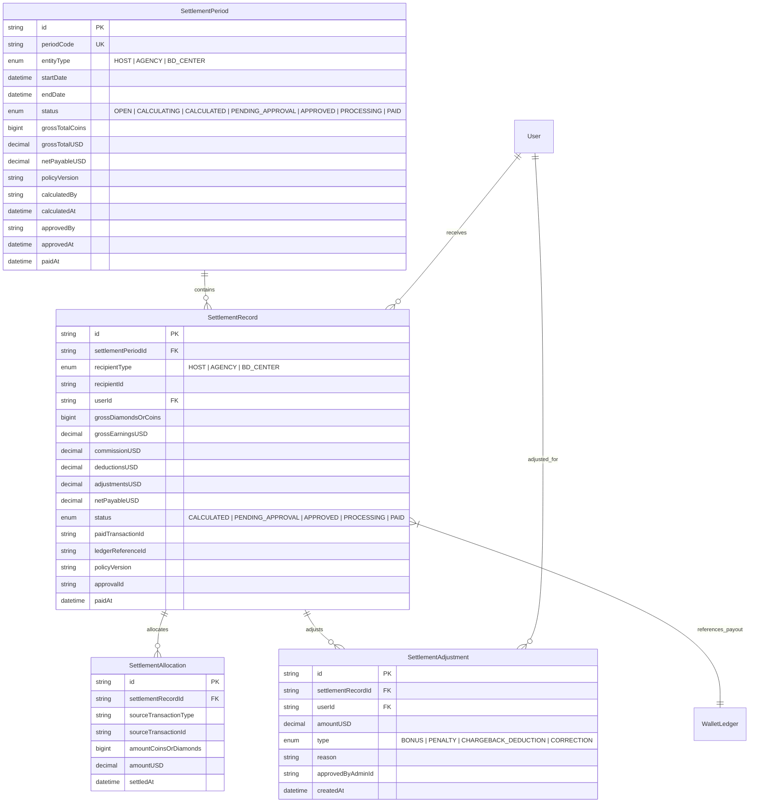
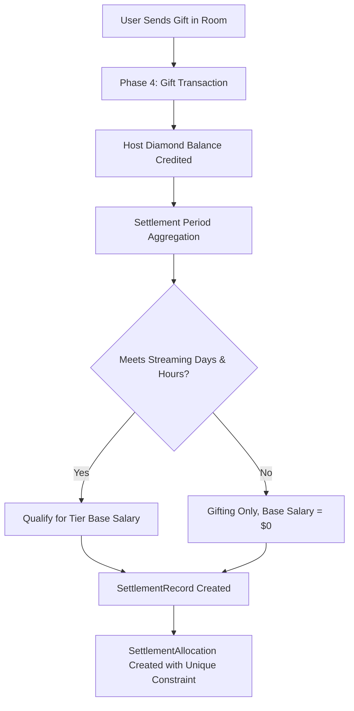
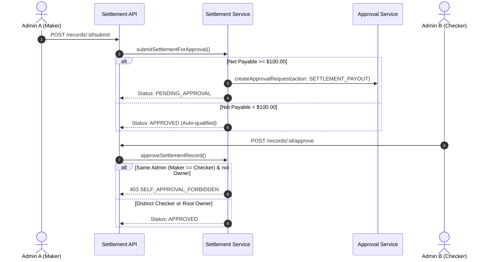
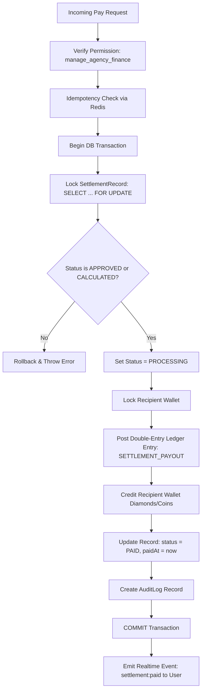

# ZeParty Backend — Settlement & Payroll Architecture (Phase 5)

## 1. Executive Summary & Architectural Invariants

Phase 5 establishes the authoritative **Host Payroll, Agency Commission, and Business Development (BD) Financial Settlement Subsystem** for ZeParty.

### Governing Architectural Rules:
> **Admin controls → Backend enforces → Mobile consumes**

> **Business event → authoritative calculation → approval where required → atomic ledger transaction → settlement record → audit → realtime notification**

1. **Backend as Sole Authority**:
   - Financial values from Admin Frontend or Mobile clients are never trusted.
   - Rates and splits are calculated strictly from server policies (`ECONOMY`, `LIVE_HOST`, `AUDIO_HOST`) and database configurations (`Agency.commissionRate`, `BDCenter.baseSalaryUSD`).
2. **Single Unified Ledger Engine**:
   - Zero duplication of wallet, balance, or ledger transaction logic.
   - All financial mutations strictly route through Phase 3 [ledger.service.js](file:///d:/PROJECTS/Ze-Party/backend/src/services/ledger.service.js) and [wallet.service.js](file:///d:/PROJECTS/Ze-Party/backend/src/services/wallet.service.js).
3. **Deterministic Arithmetic**:
   - Integer math (`BigInt`) for all Coin and Diamond quantities.
   - Exact 2-decimal USD calculations (`1.00 USD = 10,000 Diamonds = 10,000 Coins`). Zero JavaScript floating-point errors.
4. **Guaranteed Double-Settlement Prevention**:
   - `SettlementAllocation` enforces PostgreSQL database-level uniqueness on `[sourceTransactionType, sourceTransactionId]`.
   - Concurrency locking (`SELECT ... FOR UPDATE`) prevents double-payout races.

---

## 2. Settlement Data Model



---

## 3. Host Earnings Lifecycle

Host earnings originate from verified live room gifting and active streaming performance:



---

## 4. Agency Commissions

Agency commissions are calculated from the aggregate performance of all hosts contracted under the agency:

1. **Host-Agency Association**: Derives from `HostProfile.agencyId == agency.id`.
2. **Turnover Aggregation**: Sums all diamonds earned by active hosts in the settlement window $[startDate, endDate)$.
3. **Commission Calculation**:
   $$\text{Host Gifting USD} = \frac{\sum \text{Host Diamonds}}{10,000}$$
   $$\text{Commission USD} = \frac{\text{Host Gifting USD} \times \text{Agency.commissionRate}}{100}$$
   $$\text{Commission Coins} = \text{Commission USD} \times 10,000$$
4. **Payout Asset**: Payout is disbursed in platform **Coins** into the agency owner's wallet.

---

## 5. BD Center Commissions

Business Development Centers oversee managed agencies and direct hosts:

1. **Tier Base Salary**:
   - `BRONZE`: $500.00 USD
   - `SILVER`: $1,000.00 USD
   - `GOLD`: $2,000.00 USD
   - `PLATINUM`: $4,000.00 USD
   - `DIAMOND`: $8,000.00 USD
2. **Performance Milestone Bonus**:
   - If Total Managed Volume (agencies + direct hosts) $\ge \$5,000.00\text{ USD}$:
   $$\text{Bonus USD} = \text{Total Managed Volume USD} \times 0.02$$
3. **Net Earnings**:
   $$\text{BD Net USD} = \text{Base Salary USD} + \text{Bonus USD}$$

---

## 6. Settlement Periods & Boundary Handling

1. **Half-Open Range**: Precise date boundaries $[startDate, endDate)$ where $t \ge startDate$ and $t < endDate$.
2. **Anti-Overlap Protection**: Pre-validation ensures $startDate < endDate$ and period codes (`periodCode`) are unique.
3. **Lifecycle States**:
   `OPEN` $\rightarrow$ `CALCULATING` $\rightarrow$ `CALCULATED` $\rightarrow$ `PENDING_APPROVAL` $\rightarrow$ `APPROVED` $\rightarrow$ `PROCESSING` $\rightarrow$ `PAID`.

---

## 7. Authoritative Calculation Rules

All conversions obey strict integer math:
```javascript
const DIAMONDS_PER_USD = 10000n;
const COINS_PER_USD = 10000n;

export function diamondsToUSD(diamonds) {
  const big = BigInt(diamonds || 0n);
  const cents = (big * 100n) / DIAMONDS_PER_USD;
  return Number(cents) / 100;
}
```

No floating-point financial calculations are permitted.

---

## 8. Policy Versioning & Reproducibility

1. Every calculation records the exact `policyVersion` applied (e.g. `v3.0.0`).
2. If policies change in future periods:
   - Historical settlements remain immutable and retain their calculation metadata.
   - New periods fetch the latest active policy from `policyService.getEffectivePolicy(...)`.

---

## 9. Maker-Checker Two-Stage Approval Flow



---

## 10. Settlement Execution Pipeline

When `POST /v1/admin/settlements/records/:id/pay` is invoked:



---

## 11. Wallet & Ledger Interaction

- **Host Settlement**: Credits recipient's `diamondBalance` via `ledgerService.postTransaction` with `transactionType: 'SETTLEMENT_PAYOUT'`.
- **Agency Settlement**: Credits recipient's `coinBalance` with `transactionType: 'SETTLEMENT_PAYOUT'`.
- **BD Center Settlement**: Credits recipient's `diamondBalance`.
- Double-entry ledger records maintain complete balance verification.

---

## 12. Additive Non-Destructive Adjustments

- Historical ledger entries and settlements are **NEVER** destructively updated.
- Corrections are added via `SettlementAdjustment` records:
  - `BONUS`: Performance reward ($+$).
  - `PENALTY`: Rule infraction deduction ($-$).
  - `CHARGEBACK_DEDUCTION`: User chargeback clawback ($-$).
  - `CORRECTION`: Manual discrepancy correction ($\pm$).
- Formula:
  $$\text{Net Payable USD} = \text{Gross Earnings USD} - \text{Deductions USD} + \sum \text{Adjustments USD}$$

---

## 13. Refund & Chargeback Interaction

1. When a user executes a chargeback or refund for coin recharges that funded live gifts:
   - Phase 3 chargeback engine identifies recipient host earnings.
   - An approved adjustment (`CHARGEBACK_DEDUCTION`) is attached to the host's upcoming settlement record.
   - The historical settlement remains untouched.

---

## 14. Automated Accounting Reconciliation

The reconciliation engine (`reconcileSettlementPeriod`) verifies two core invariants:

1. **Allocation Sum Check**:
   $$\sum \text{SettlementAllocation.amountUSD} = \text{SettlementRecord.grossEarningsUSD}$$
2. **Net Balance Check**:
   $$\text{Gross} - \text{Deductions} + \sum \text{Adjustments} = \text{Net Payable USD}$$
3. Any discrepancy is flagged with the exact delta and reason (`NET_PAYABLE_MISMATCH`).

---

## 15. Idempotency Protection

- All write endpoints (`/calculate`, `/submit`, `/approve`, `/pay`, `/adjust`) use `idempotencyMiddleware`.
- Uses SHA-256 payload hashing stored in Redis / memory cache.
- Replayed requests return cached identical responses without executing duplicate mutations.
- Conflicting requests with the same key but different payloads return `409 CONFLICT`.

---

## 16. Concurrency & Race Condition Safety

- **Row Locks**: Uses PostgreSQL `FOR UPDATE` on `SettlementRecord` and `Wallet`.
- **Transient State**: Transitions status to `PROCESSING` within the same transaction to deflect parallel payout attempts.
- Concurrent payout attempts result in:
  - First caller: `200 OK` (Paid)
  - Second caller: `400 Bad Request` (`SETTLEMENT_ALREADY_PAID`)

---

## 17. Role-Based Access Control (RBAC)

Canonical Phase 1 permissions enforced:
- `view_finance`: Read settlement periods, statements, and reconciliation data.
- `manage_agency_finance`: Calculate periods, submit for approval, approve settlements, execute payouts, and create adjustments.
- `Root Owner`: Holds unconditional wildcard access (`'*'`).

---

## 18. IDOR & Multi-Tenant Isolation

1. **Host Isolation**: `/v1/settlements/hosts/settlements/:id` asserts `record.userId === req.auth.userId`. Attempts to access other host statements return `404 Not Found`.
2. **Agency Isolation**: Agency statements verify `record.recipientType === 'AGENCY'` and `record.userId === req.auth.userId`.
3. **BD Isolation**: BD statements verify `record.recipientType === 'BD_CENTER'` and `record.userId === req.auth.userId`.

---

## 19. Realtime Socket Events

Emitted via [socket.emitter.js](file:///d:/PROJECTS/Ze-Party/backend/src/socket/socket.emitter.js) strictly **AFTER** database commit:
- `settlement:created`: Period calculation complete.
- `settlement:approved`: Statement approved by checker.
- `settlement:paid`: Funds disbursed to recipient user room (`user:<userId>`).
- `settlement:adjusted`: Non-destructive adjustment applied.

---

## 20. API Endpoint Summary

### Admin Endpoints
| Method | Endpoint | Permission | Description |
|---|---|---|---|
| `POST` | `/v1/admin/settlements/calculate` | `manage_agency_finance` | Calculate period earnings & allocations |
| `GET` | `/v1/admin/settlements/periods` | `view_finance` | List settlement periods |
| `GET` | `/v1/admin/settlements/periods/:id` | `view_finance` | Get period summary & records |
| `GET` | `/v1/admin/settlements/periods/:id/reconcile` | `view_finance` | Run accounting reconciliation report |
| `GET` | `/v1/admin/settlements/records` | `view_finance` | List settlement statements with filters |
| `GET` | `/v1/admin/settlements/records/:id` | `view_finance` | Get detailed statement with allocations |
| `POST` | `/v1/admin/settlements/records/:id/submit` | `manage_agency_finance` | Submit for two-stage approval |
| `POST` | `/v1/admin/settlements/records/:id/approve` | `manage_agency_finance` | Maker-checker approval |
| `POST` | `/v1/admin/settlements/records/:id/pay` | `manage_agency_finance` | Execute payout (idempotent & locked) |
| `POST` | `/v1/admin/settlements/records/:id/adjust` | `manage_agency_finance` | Add non-destructive adjustment |

### Mobile / Consumer Endpoints (IDOR Protected)
| Method | Endpoint | Auth | Description |
|---|---|---|---|
| `GET` | `/v1/settlements/hosts/earnings/summary` | Authenticated | Current month diamond earnings & progress |
| `GET` | `/v1/settlements/hosts/settlements` | Authenticated | Host settlement statement history |
| `GET` | `/v1/settlements/hosts/settlements/:id` | Authenticated | Host settlement statement details |
| `GET` | `/v1/settlements/agencies/settlements` | Authenticated | Agency commission statement history |
| `GET` | `/v1/settlements/bd-centers/settlements` | Authenticated | BD Center settlement statement history |
