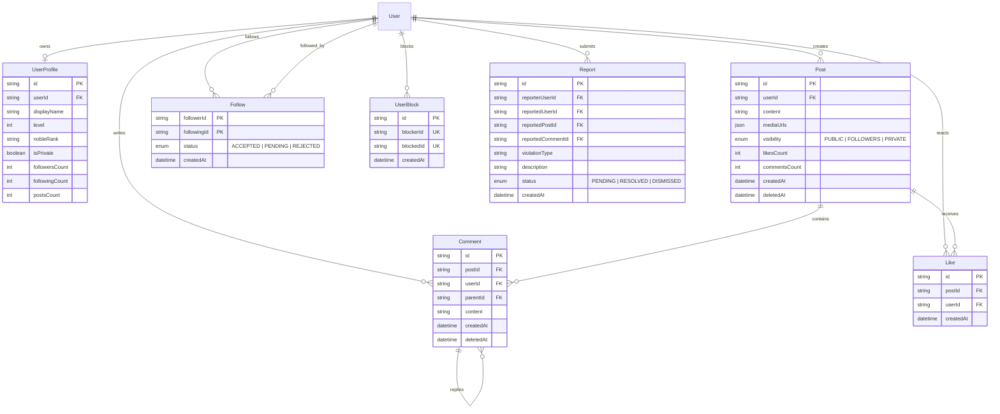
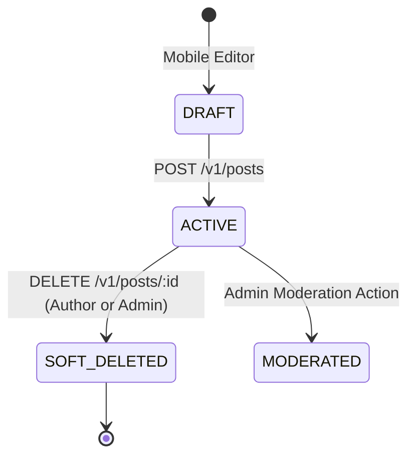

# ZeParty Backend — Social, Community, Feed & Engagement Architecture (Phase 6)

## 1. Executive Summary & Governing Principles

Phase 6 establishes the authoritative **Social, Community, Feed, and Engagement Subsystem** for ZeParty.

### Governing Architectural Rules:
> **Admin controls → Backend enforces → Mobile consumes**

> **PostgreSQL = persistent authority → Backend services = business rules → Socket.IO = realtime distribution → Flutter = presentation**

1. **PostgreSQL as Persistent Authority**:
   - User profiles, posts, comments, likes, follows, blocks, and reports reside in PostgreSQL.
   - Engagement counters (`likesCount`, `commentsCount`, `followersCount`, `followingCount`, `postsCount`) are maintained with atomic database mutations.
2. **Server-Side Authorization & IDOR Defense**:
   - Author IDs are derived strictly from JWT authentication.
   - Modifying or deleting another user's content is blocked with `403 Forbidden`.
3. **Privacy by Design**:
   - Private accounts restrict post feeds, follower lists, and social data to accepted followers only.
4. **Post-Commit Realtime Broadcasts**:
   - Socket.IO events (`post:created`, `post:liked`, `comment:created`, `follow:created`, etc.) fire strictly **after** database transactions commit.

---

## 2. Social Entity Data Model

---

## 3. Social Profile Architecture & Privacy Model

### Public Social Profile
- Exposes: `id`, `username`, `avatarUrl`, `bio`, `displayName`, `level`, `vipLevel`, `svipLevel`, `nobleRank`, `isPrivate`, `followersCount`, `followingCount`, `postsCount`, `isFollowing`, `isFollowedBy`, `canViewPosts`.
- Never Exposes: `email`, `phone`, `passwordHash`, `wallet`, or internal administration metadata.

### Privacy Enforcement
- **Public Accounts (`isPrivate: false`)**:
  - Anyone can view profile posts and follower/following lists.
  - Follow requests are auto-approved (`status: 'ACCEPTED'`).
- **Private Accounts (`isPrivate: true`)**:
  - Only accepted followers can view posts, followers, and following lists.
  - New follows enter `status: 'PENDING'`.

---

## 4. Post Lifecycle & Visibility Gate

### Visibility Levels:
1. **`PUBLIC`**: Visible to all users and public feeds.
2. **`FOLLOWERS`**: Visible only to accepted followers of the author.
3. **`PRIVATE`**: Visible exclusively to the author.

---

## 5. Feed Generation & Deterministic Pagination

### Feed Types:
1. **`PUBLIC` Feed**: Displays public posts from all active platform creators, filtering out blocked users and deleted posts.
2. **`FOLLOWING` Feed**: Displays public and followers-only posts strictly from creators the viewer follows.

### Stable Cursor-Based Pagination:
- **Ordering**: `[createdAt DESC, id DESC]` ensures consistent ordering even when multiple posts share the same millisecond timestamp.
- **Cursor Format**: Opaque base64 string `Buffer.from(createdAt.toISOString() + ':' + id).toString('base64')`.

---

## 6. Likes & Reactions

- **Endpoint**: `POST /v1/posts/:id/like` and `DELETE /v1/posts/:id/like`.
- **Database Constraint**: `@@unique([userId, postId])` prevents duplicate likes under concurrent requests.
- **Non-Negative Invariant**: Guaranteed `likesCount >= 0`.
- **Realtime Broadcast**: Emits `post:liked` / `post:unliked` to author's socket room.

---

## 7. Comments & Nested Replies

- **Endpoint**: `POST /v1/posts/:id/comments` and `GET /v1/posts/:id/comments`.
- **Replies**: Optional `parentId` enables 2-tier threaded discussion. Validates `parent.postId === postId`.
- **Soft Deletion**: `DELETE /v1/posts/comments/:id` decrements `commentsCount`.
- **Ownership Gate**: Comment author, post author, or authorized Admin can delete comments.

---

## 8. Follow Graph & Invariants

- **Endpoint**: `POST /v1/users/:id/follow` and `DELETE /v1/users/:id/follow`.
- **Self-Follow Block**: Attempts to follow self return `400 CANNOT_FOLLOW_SELF`.
- **Composite Primary Key**: `@@id([followerId, followingId])` eliminates duplicate follow entries.
- **Atomic Counters**: Updates `followersCount` and `followingCount` in synchronization.

---

## 9. Blocking & Moderation Reporting Hooks

- **User Blocks**: `POST /v1/users/:id/block` removes bidirectional follow ties and prevents post/comment visibility.
- **Reporting Hook**: `POST /v1/posts/:id/report` and `POST /v1/users/:id/report` creates `Report` tickets routed to the administrative review queue.

---

## 10. Role-Based Access Control (RBAC)

- Normal users can manage only their own posts, comments, likes, and privacy.
- Administrators with `delete_user_posts` permission or Root Owners can moderate and delete any post or comment.
- Administrative deletions generate immutable records in `AuditLog`.

---

## 11. Realtime Socket.IO Events

Emitted via [socket.emitter.js](file:///d:/PROJECTS/Ze-Party/backend/src/socket/socket.emitter.js) strictly **after** database commits:

| Event Name | Scope | Description |
|---|---|---|
| `post:created` | Global / Targeted | New public or followers post published |
| `post:deleted` | Global | Post soft-deleted |
| `post:liked` | Post Author Room | User liked post |
| `post:unliked` | Post Author Room | User unliked post |
| `comment:created` | Post Author Room | New comment added |
| `comment:deleted` | Comment Author Room | Comment deleted |
| `follow:created` | Followed User Room | Follow relationship established |
| `follow:removed` | Unfollowed User Room | Follow relationship severed |

---

## 12. API Endpoint Matrix

### Consumer Endpoints
| Method | Endpoint | Auth | Description |
|---|---|---|---|
| `POST` | `/v1/posts` | Required | Create a new post |
| `GET` | `/v1/posts/:id` | Optional | Get post details by ID |
| `DELETE` | `/v1/posts/:id` | Required | Soft-delete own post |
| `POST` | `/v1/posts/:id/like` | Required | Like a post (idempotent) |
| `DELETE` | `/v1/posts/:id/like` | Required | Unlike a post |
| `POST` | `/v1/posts/:id/comments` | Required | Add a comment or reply |
| `GET` | `/v1/posts/:id/comments` | Optional | Get paginated comments |
| `DELETE` | `/v1/posts/comments/:id` | Required | Delete own comment |
| `POST` | `/v1/posts/:id/report` | Required | Report inappropriate post |
| `GET` | `/v1/feed` | Optional | Get paginated feed |
| `GET` | `/v1/users/:id/social-profile` | Optional | Get public social profile |
| `PUT` | `/v1/users/me/privacy` | Required | Update account privacy |
| `POST` | `/v1/users/:id/follow` | Required | Follow user |
| `DELETE` | `/v1/users/:id/follow` | Required | Unfollow user |
| `GET` | `/v1/users/:id/followers` | Optional | Get user followers |
| `GET` | `/v1/users/:id/following` | Optional | Get user following list |
| `POST` | `/v1/users/:id/block` | Required | Block user |
| `DELETE` | `/v1/users/:id/block` | Required | Unblock user |

### Admin Endpoints
| Method | Endpoint | Permission | Description |
|---|---|---|---|
| `GET` | `/v1/admin/posts` | `view_users` | List all platform posts |
| `DELETE` | `/v1/admin/posts/:id` | `delete_user_posts` | Moderation delete post |
| `DELETE` | `/v1/admin/posts/comments/:id` | `delete_user_posts` | Moderation delete comment |
